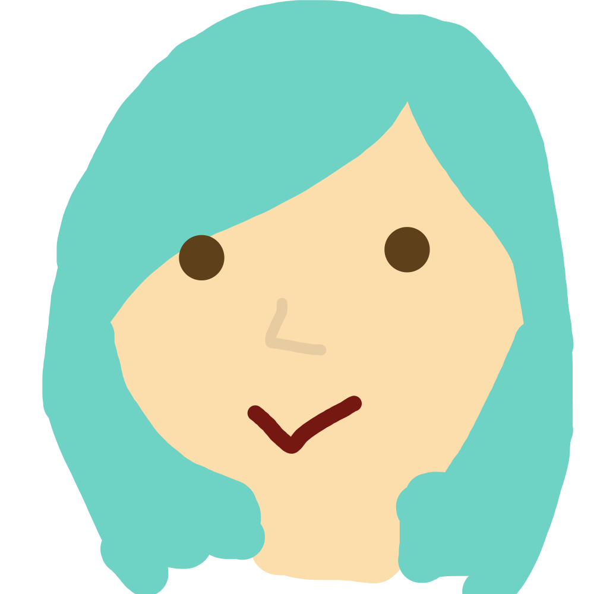

## Wann und wo findet die Feier statt?
Am **13.07.2019** im Waldhaus Staufen ab 17.00 Uhr. Den Lageplan und die Anreisemöglichkeiten zum Waldhaus sind unten auf der Seite aufgelistet.

## Wieso 110 Jahre?

    

        
        

Urs Jäger wird knackige

60 Jahre jung.

    

    

        
        

Ben Jäger zählt

30 Jahre Lebenserfahrung.

    

    

        
        

Stefi Jäger feiert ihr

20. Geburtsjubiläum.

    

## Wie melde ich mich an?
Wer kommen möchte, füllt bitte dieses [Doodle](https://doodle.com/poll/i4ahgzuqmb4m6mvh) bis am **12.05.2019** aus.
Wer mit Doodle nicht zurecht kommt, darf sich per E-mail oder Telefon bei Margrit melden.

## Wie reist man an?
#### Das Waldhaus befindet sich hier:
<iframe src="https://www.google.com/maps/embed?pb=!1m18!1m12!1m3!1d2702.0486533845747!2d8.15800245158025!3d47.371968879067474!2m3!1f0!2f0!3f0!3m2!1i1024!2i768!4f13.1!3m3!1m2!1s0x479016217df69f0f%3A0x69ef82d10e837a54!2sWaldhaus+Staufen!5e0!3m2!1sen!2sch!4v1549459269004" height="450" width="100%" frameborder="0" style="border:0" allowfullscreen></iframe>

#### Parkieren
In der näheren Umgebung hat es genügend Parkplätze, bitte Schilder beachten.

#### Für ÖV-Nutzer:
Selbstständige Anreise an Lenzburg Bahnhof. 
Wenn Shuttle zur Waldhütte gewünscht ist, im Doodle bitte vermerken, dann wird man mit dem Jäger Shuttle abgeholt und direkt zur Waldhütte gebracht.

## Soll man was mit bringen?
Wir lassen uns gerne überraschen, freuen uns aber auch über eure Anwesenheit als Geschenk.

## Was wenn es nach der Feier zu spät und zu 🍺 🍹 🍷 wird?
Bitte im Doodle anmerken, wenn Hotelzimmerreservation erwünscht.

## Ist für Verpflegung gesorgt?
Es gibt [Grill](https://www.grillrad.ch) und Salate.
#### Bei Allergien, Vegetarier, Vegan etc.
Bei Allergien, Vegetarismus, Veganismus oder anderen Problemen bitte im Doodle anmerken.
